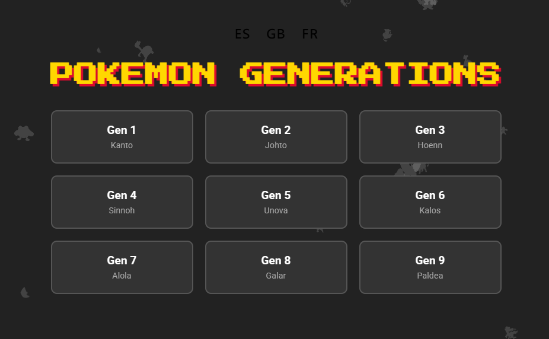
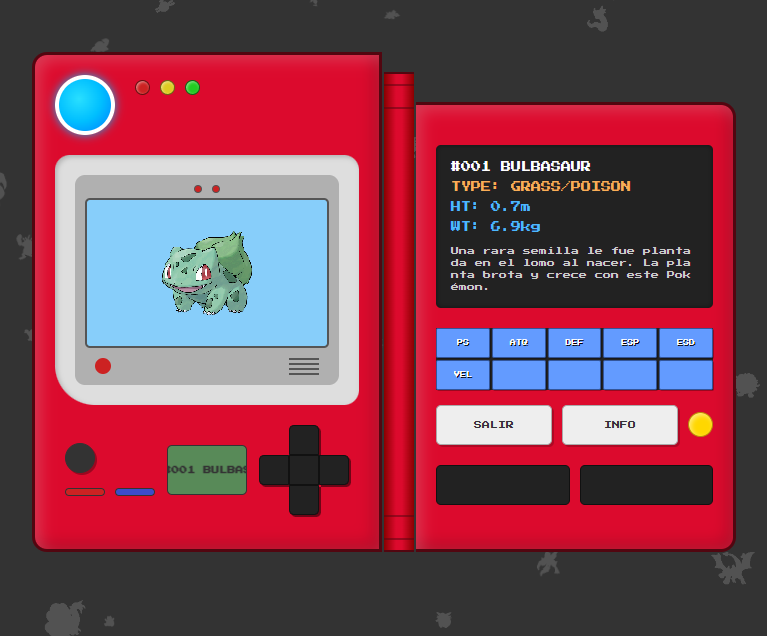

# 🔴 Pokedex Web - Pokemon Generations

A fully interactive, retro-styled Pokedex web application that allows users to explore Pokemon from **Generations 1 through 9**. Built with **HTML, CSS, and Vanilla JavaScript**, fetching real-time data from [PokeAPI](https://pokeapi.co/).



## ✨ Features

-   **Multi-Generation Support**: Browse Pokemon from Kanto (Gen 1) to Paldea (Gen 9).
-   **Retro Design**: Styled to resemble a classic handheld Pokedex device.
-   **Interactive Controls**:
    -   **D-Pad**: Navigate effectively through the Pokemon list.
    -   **Blue Keys**: Quick jump to specific sections of the generation.
    -   **Info Menu**: Detailed popup with Stats, Abilities (hidden included), and Shiny sprites.
-   **Localizations 🌍**:
    -   Full support for **Spanish (ES)**, **English (EN)**, and **French (FR)**.
    -   Automatically saves your language preference.
    -   Translates interface, stats, types, and Pokemon flavor text descriptions.
-   **Dynamic Visuals**:
    -   Background particle effects (Pokemon silhouettes).
    -   Animated "Green Scouter" marquee.
    -   High-quality sprites and pixel art.



## 🚀 Technologies

-   **HTML5**
-   **CSS3** (Flexbox/Grid, Animations, Glassmorphism)
-   **JavaScript (ES6+)**
-   **API**: [PokeAPI](https://pokeapi.co/)

## 🛠️ Installation & Usage

1.  **Clone the repository**:
    ```bash
    git clone https://github.com/Start-Ancor/pokedex.git
    cd pokedex
    ```
2.  **Run Locally**:
    -   Simply open `index.html` in your browser.
    -   Or use a live server (e.g., VS Code Live Server) for the best experience.

## 🎮 How to Use

1.  Select your preferred **Language** on the Landing Page.
2.  Choose a **Generation** to load.
3.  Use the **D-Pad** (Left/Right) to browse Pokemon.
4.  Press **INFO** to see detailed stats and shiny forms.
5.  Press **EXIT** to return to the generation select screen.

---
*Created with ❤️ by Ancor.*
